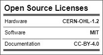
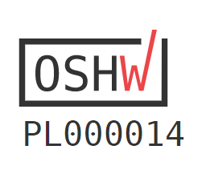
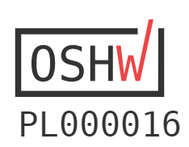
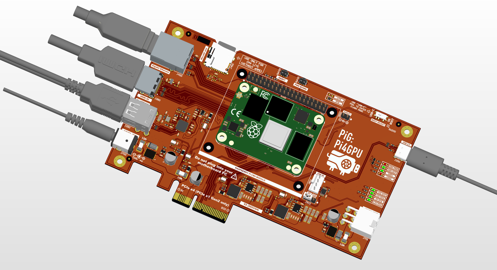

# PiG (Pi4GPU)
Raspberry Pi CM4 carrier board for testing GPU cards

## Description

Dedicated carrier board for Raspberry Pi CM4 module (and compatible models) for testing high-performance GPU cards, enclosed in the standard PCIe form factor card.

Technical specification:
- ports: HDMI, 1GbE RJ45, 2x USB 2.0 host (Type A);
- power supply inputs: 12VDC DC barrel jack or 6-pin Molex (8A max.);
- microSD slot for CM4 Lite module;
- full 40-pin GPIO pin header;
- 4-pin fan socket (controlled by EMC2301) - 5/12V version supported;
- USB-C for flashing CM4 module;
- system and user LEDs;
- PCIe x4 edge connector (PCIe x1 lane only implemented);
- I2C diagnostics module for analog measurements (system power rails, 3.3V/5V/12V, voltage/current);

## License

Project published as Open Source Hardware (OSHW) under CERN OHL v1.2 (Open Hardware License).

Project has been certified as Open Source Hardware by the Open Source Hardware Association (OSHWA).

UID is (for v1): PL000014

UID is (for v2): PL000016

https://certification.oshwa.org/pl000014.html

https://certification.oshwa.org/pl000016.html

## Press release

[Jeff Geerling Blog] (https://www.jeffgeerling.com/blog/2023/i-built-special-pcie-card-test-gpus-on-pi)

[Jeff Geerling video review] (https://www.youtube.com/watch?v=l9dItRUjQ0k)

[Hackster.io] (https://www.hackster.io/news/jeff-geerling-s-pig-makes-it-easier-to-experiment-with-pcie-add-in-boards-on-the-raspberry-pi-cm4-fdb977047521)

## Photos

